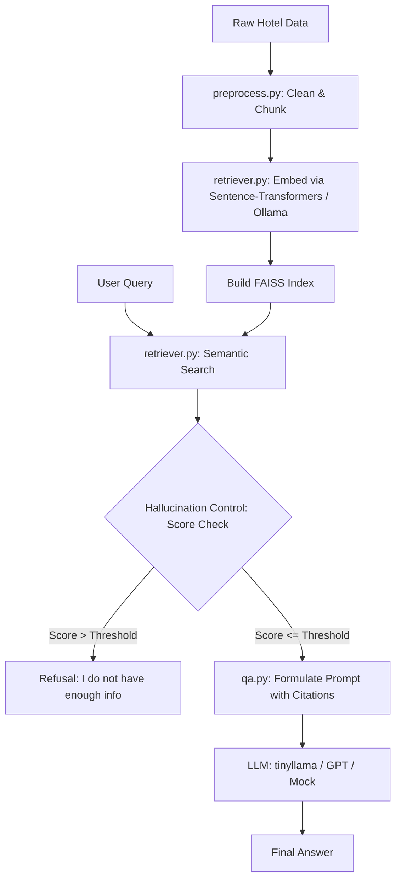

# RAG-Based Hotel Q&A System

A Retrieval-Augmented Generation (RAG) system for answering natural language queries about hotels using a curated text dataset. The system combines semantic search over a FAISS vector store with a language model (local Ollama, Hugging Face, or OpenAI) to produce accurate, context-grounded responses with strict hallucination controls.

---

## Architecture Overview



The system is designed with a modular architecture:
1. **Dataset**: 44 documents across 5 hotels (Grand Plaza Hotel, Seaside Haven Resort, Hotel X, Alpine Lodge, Sunrise B&B) spanning Descriptions, Amenities, Reviews, Policies, and Location Details.
2. **Preprocessing**: Cleans raw text (HTML removal, whitespace normalization) and splits documents into small focus chunks (400 chars, 80 chars overlap). Each chunk is prefixed with contextual metadata (Hotel, Category) to maximize retrieval precision.
3. **Retrieval**: Leverages a **FAISS vector database** populated with dense embeddings from `sentence-transformers/all-MiniLM-L6-v2` (default) or Ollama `nomic-embed-text`.
4. **Generative QA & Hallucination Control**: Synthesizes responses using local Ollama `tinyllama:chat`, OpenAI, or a high-fidelity mock model.
5. **Streamlit UI**: A premium dark-themed visual dashboard showcasing chatting, visual retrieval inspect, metrics, and dataset browsing.

---

## Hallucination Control Mechanics

To ensure the system answers **only** from the provided context and avoids hallucination, the following controls are implemented:

1. **Similarity / Confidence Thresholding**:
   - For every query, the system measures the semantic distance of the retrieved chunks in FAISS (L2 distance).
   - If the L2 distance of the top match exceeds a preconfigured threshold (e.g. `0.75`), the system immediately skips LLM generation and returns a standard refusal: *"I do not have enough information in my context to answer this query."* This prevents the LLM from trying to answer questions for which there is no data.
2. **Strict Context-Only Prompting**:
   - The LLM is instructed via a strict system prompt to act as a factual assistant. It is strictly forbidden from using general knowledge, making assumptions, or extrapolating beyond the facts provided in the context.
3. **Mandatory Source Citations**:
   - The prompt requires the LLM to cite the source Document IDs (e.g. `[DOC-33]`) for every fact it states. This forces grounding and makes verification straightforward.

---

## Automated Evaluation Metrics

Retrieval quality is programmatically measured on three standard test queries using a top-k ($k=3$) constraint:

1. **Precision@k**: Measures the proportion of retrieved chunks that are relevant.
   $$\text{Precision@k} = \frac{\text{Relevant Chunks Retrieved in Top-k}}{k}$$
2. **Recall@k**: Measures the proportion of ground truth relevant chunks that are retrieved.
   $$\text{Recall@k} = \frac{\text{Relevant Chunks Retrieved in Top-k}}{\text{Total Ground Truth Relevant Chunks}}$$
3. **Mean Reciprocal Rank (MRR)**: Measures the reciprocal rank of the first relevant document.
   $$\text{MRR} = \frac{1}{\text{Rank of first relevant chunk}}$$

---

## Setup & Running Instructions

### 1. Prerequisites
Ensure you have Python 3.9+ installed.

### 2. Install Dependencies
Install all required libraries using the provided `requirements.txt`:
```bash
pip install -r requirements.txt
```

### 3. Generate the Dataset
Create the synthetic JSON and TXT documents:
```bash
python generate_dataset.py
```
This generates `hotel_dataset.json` and populates the `dataset/` directory.

### 4. Build the FAISS Index
Build the vector store from the preprocessed dataset:
```bash
python rag.py
```
This creates the FAISS index under `faiss_index/` using the default local Hugging Face embedding model.

### 5. Run Evaluation
Run the automated evaluation suite:
```bash
python evaluate.py
```
This executes the RAG pipeline for the three assessment queries, computes Precision, Recall, and MRR, and demonstrates hallucination control.

### 6. Launch the HTML Web App
Run the new interactive HTML dashboard powered by Flask:
```bash
python app.py
```
Open the browser at `http://localhost:8503`.
> ```

---

## Known Limitations

- **Hardware Dependencies**: Local loading of `sentence-transformers` via PyTorch takes ~10-15 seconds to load on typical CPUs during startup.
- **Context Size Constraints**: If the retrieved text chunks are very large, smaller local models like `tinyllama:chat` can sometimes lose context depth. This is mitigated by our small chunk size strategy (400 characters).
