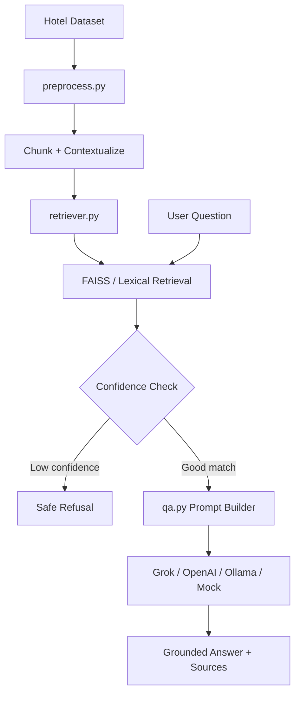

# StayChat AI: Hotel RAG Assistant


StayChat AI is a Retrieval-Augmented Generation (RAG) hotel Q&A system that answers natural language questions from a curated hotel knowledge base. It retrieves the most relevant hotel records, applies hallucination controls, and generates grounded answers using Grok, OpenAI, Ollama, or a built-in deterministic fallback.

The app is designed to run locally and deploy cleanly on Render.

## Highlights

| Capability | What it does |
| --- | --- |
| Grounded hotel Q&A | Answers questions about WiFi, breakfast, cancellation, beach access, amenities, location, and reviews. |
| FAISS retrieval | Finds relevant chunks from the hotel dataset using vector search or hosted lexical fallback. |
| Grok-ready deployment | Uses `XAI_API_KEY` on Render with `grok-4.3` by default. |
| Hallucination control | Blocks weak matches and forces context-only answers with source citations. |
| Multiple backends | Supports Grok, OpenAI, Ollama, Hugging Face embeddings, and mock fallback. |
| Web interfaces | Includes a polished Flask web app and a Streamlit dashboard. |

## Architecture



## Project Structure

| File | Purpose |
| --- | --- |
| `app.py` | Flask API and HTML web app entry point. |
| `qa.py` | RAG orchestration, prompting, LLM calls, and fallback answers. |
| `retriever.py` | FAISS loading, embedding selection, retrieval, and lexical fallback. |
| `preprocess.py` | Cleans and chunks the hotel dataset. |
| `generate_dataset.py` | Generates the synthetic hotel dataset. |
| `evaluate.py` | Runs retrieval metrics and hallucination-control checks. |
| `templates/index.html` | Main Flask web UI. |
| `streamlit_app.py` | Streamlit dashboard version. |
| `render.yaml` | Render deployment configuration. |

## LLM And Search Backends

| Layer | Options |
| --- | --- |
| Answer generation | Grok API, OpenAI API, local Ollama, built-in mock fallback |
| Retrieval | FAISS with Hugging Face embeddings, OpenAI embeddings, Ollama embeddings, lexical fallback |
| Hosted behavior | Render defaults to hosted-safe lexical retrieval and Grok answer generation |

## Hallucination Controls

StayChat AI is built to avoid unsupported answers:

1. It retrieves the closest hotel records for the question.
2. It checks the best match distance against a configurable threshold.
3. If confidence is low, it returns:

```text
I do not have enough information in my context to answer this query.
```

4. If confidence is acceptable, it sends only the retrieved context to the LLM.
5. The prompt asks the model to cite document IDs such as `[DOC-33]`.

## Quick Start

### 1. Install Dependencies

```bash
pip install -r requirements.txt
```

### 2. Generate Dataset

```bash
python generate_dataset.py
```

This creates `hotel_dataset.json` and fills the `dataset/` folder.

### 3. Build The FAISS Index

```bash
python retriever.py
```

This builds the local `faiss_index/` folder.

### 4. Run The Flask App

```bash
python app.py
```

Open:

```text
http://localhost:8503
```

### 5. Run Evaluation

```bash
python evaluate.py
```

The evaluation script reports retrieval quality using Precision@k, Recall@k, and Mean Reciprocal Rank.

## Render Deployment With Grok

The app is ready for Render through `render.yaml`.

Add this environment variable in the Render dashboard:

```bash
XAI_API_KEY=your_xai_key
```

Optional model override:

```bash
XAI_MODEL=grok-4.3
```

`render.yaml` already declares `XAI_API_KEY` as a secret using `sync: false`, so the real key should be added only in Render's Environment tab. Do not commit API keys to GitHub.

When deployed, the Flask UI uses **Grok answer** by default. If the Grok key is missing or an API call fails, the app falls back to the built-in answer mode instead of crashing.

## Example Questions

```text
Which hotels have free WiFi and complimentary breakfast?
```

```text
What is the cancellation policy of Hotel X?
```

```text
Suggest a hotel with excellent reviews near the beach.
```

## Evaluation Metrics

| Metric | Meaning |
| --- | --- |
| Precision@k | How many retrieved records are relevant. |
| Recall@k | How many expected relevant records were retrieved. |
| MRR | How high the first relevant result appears. |

## Known Limitations

- Local Hugging Face embedding models can take several seconds to load on CPU.
- Ollama backends require Ollama running locally and are not suitable for Render free hosting.
- Small local models can miss details if too much context is sent, so the app uses compact chunks and strict prompting.

## Tech Stack

`Python` · `Flask` · `FAISS` · `LangChain` · `sentence-transformers` · `xAI Grok` · `OpenAI SDK` · `Render` · `Streamlit`
