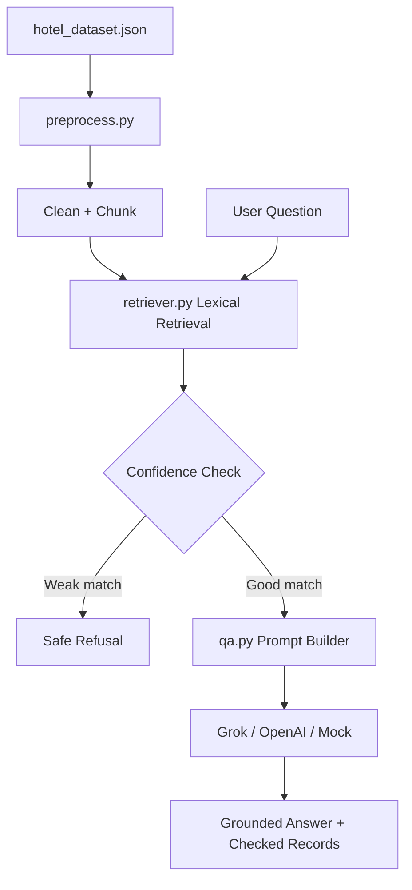

# StayChat AI: Render-Ready Hotel RAG Assistant


StayChat AI answers hotel questions from a curated JSON knowledge base. It retrieves relevant hotel facts, applies hallucination controls, and generates grounded answers with Grok, OpenAI, or a built-in deterministic fallback.

The hosted app is designed for Render Web Services: no Ollama, no local model server, no local vector database, no ngrok, and no manual process running on your personal computer.

## Highlights

| Capability | What it does |
| --- | --- |
| Render-safe retrieval | Uses lightweight lexical retrieval from `hotel_dataset.json`. |
| Cloud LLM support | Uses Grok through `XAI_API_KEY`, with optional OpenAI support through `OPENAI_API_KEY`. |
| Safe fallback | Falls back to the built-in answer mode if an external LLM key is missing or fails. |
| JSON-safe API | `/query` and `/health` always return JSON responses. |
| Clear logs | Server exceptions are logged with stack traces for Render logs. |
| Free-tier friendly | Avoids heavy FAISS, PyTorch, sentence-transformers, and Ollama dependencies. |

## Architecture



## Project Structure

| File | Purpose |
| --- | --- |
| `app.py` | Flask app, API routes, JSON error handling, and Render entry point. |
| `qa.py` | RAG orchestration, prompt creation, Grok/OpenAI calls, and mock fallback. |
| `retriever.py` | Hosted-safe lexical retrieval from the bundled JSON dataset. |
| `preprocess.py` | Cleans and chunks hotel documents without external splitter dependencies. |
| `generate_dataset.py` | Regenerates the hotel dataset files. |
| `evaluate.py` | Runs retrieval metrics and hallucination-control checks. |
| `templates/index.html` | Main web UI. |
| `static/style.css` | UI styling. |
| `render.yaml` | Render infrastructure configuration. |
| `Procfile` | Gunicorn start command fallback. |

## Quick Start

```bash
pip install -r requirements.txt
python app.py
```

Open locally:

```text
http://localhost:8503
```

Run evaluation:

```bash
python evaluate.py
```

## API

Health check:

```bash
GET /health
```

Ask a question:

```bash
POST /query
Content-Type: application/json

{
  "question": "What is the cancellation policy of Hotel X?",
  "llm_backend": "Grok API",
  "k": 3,
  "hallucination_control": true,
  "confidence_threshold": 0.75
}
```

## Render Deployment

### Build Command

```bash
python -m pip install --upgrade pip && pip install -r requirements.txt
```

### Start Command

```bash
gunicorn app:app --bind 0.0.0.0:$PORT --workers 1 --timeout 120
```

### Required Environment Variables

| Key | Required | Value |
| --- | --- | --- |
| `PYTHON_VERSION` | Yes | `3.11.9` |
| `XAI_API_KEY` | Recommended | Your xAI/Grok API key |
| `XAI_MODEL` | No | `grok-4.3` |
| `DEFAULT_LLM_BACKEND` | No | `Grok API` |
| `LOG_LEVEL` | No | `INFO` |
| `PYTHONUNBUFFERED` | No | `1` |

Optional OpenAI support:

| Key | Required | Value |
| --- | --- | --- |
| `OPENAI_API_KEY` | No | Your OpenAI API key |
| `OPENAI_MODEL` | No | `gpt-3.5-turbo` or another chat model |

`render.yaml` already declares `XAI_API_KEY` as a secret using `sync: false`, so add the real key only in Render's Environment tab. Do not commit API keys to GitHub.

## Example Questions

```text
Which hotels have free WiFi and complimentary breakfast?
```

```text
What is the cancellation policy of Hotel X?
```

```text
Suggest a hotel with excellent reviews near the beach.
```

## Hallucination Controls

1. Retrieve the closest hotel records.
2. Compare the best match against a confidence threshold.
3. Refuse weak matches with:

```text
I do not have enough information in my context to answer this query.
```

4. Send only retrieved context to the selected LLM.
5. Ask the model to cite document IDs such as `[DOC-33]`.

## Tech Stack

`Python` · `Flask` · `Gunicorn` · `OpenAI SDK` · `xAI Grok` · `Render` · `Streamlit`
